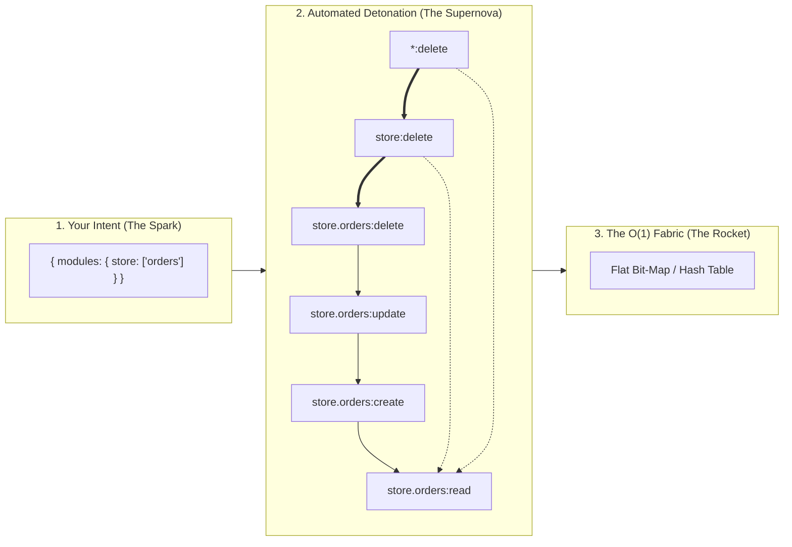
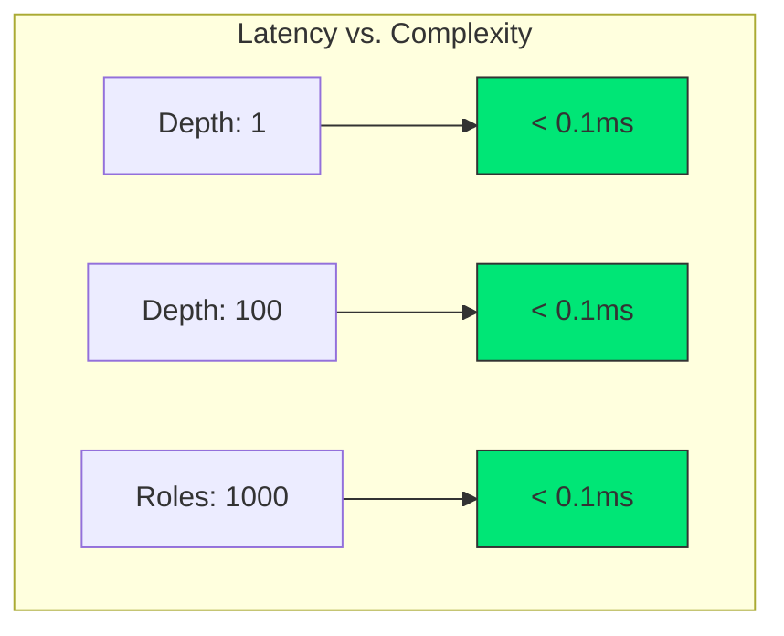
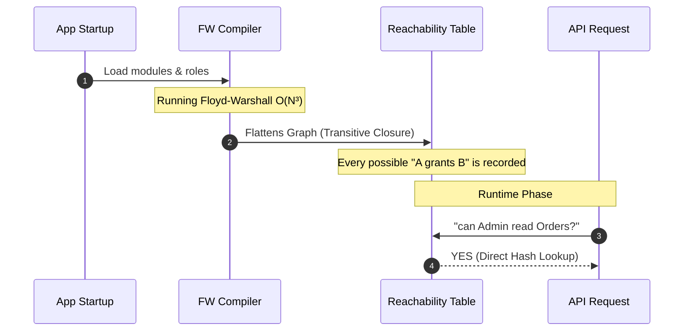

# 🚀 Authz-Engine: The O(1) Authorization Supernova

> **High-Performance Hierarchical RBAC. Zero Latency. Infinite Scale.**
> 
> `authz-engine` isn't a simple permission checker; it's a compiler for access control. It ingests your high-level intent and "detonates" it into a flat, O(1) reachability mesh that resolves any complex permission query in less than 0.1ms.

## 📦 Installation
```bash
npm install authz-engine
```

---

## 💥 The "Expansion" Effect: From 5 Lines to 100+ Nodes

Define your modules once. The engine automatically expands them across two dimensions of authority, creating a "Universal Coverage Mesh."



> **The Rocket Power:** One line of config (`store: ['orders']`) generates a 4-tier hierarchy across every CRUD action. Granting a single "Root" permission instantly secures the entire sub-tree without manual mapping.

---

## 🏎️ Performance: Breaking the Latency Wall

Most authorization libraries fail as you scale. `authz-engine` uses **Transitive Closure (Floyd-Warshall)** to ensure that whether you have 10 permissions or 10,000, the check time is **identical**.



---

## 🛠️ The "Fluent" Command Center

Stop guessing string names. The engine's Proxy API provides a type-safe, semantic interface that acts as your IDE's co-pilot.

```typescript
const rbac = new PermissionService(config);

// 1. Semantic Clarity: 'readStoreOrders' is auto-generated
// 2. Performance: O(1) lookup
// 3. Resilience: Typo-protection via Proxy
if (rbac.can.readStoreOrders(userPermissions)) {
  // Access granted instantly
}
```

---

## 🧠 Architectural Deep Dive: The Compiler Strategy

The engine treats your RBAC configuration like source code and compiles it into an optimized runtime artifact.



> **Structural Insight:** By shifting the computational "heavy lifting" to the startup phase, we eliminate the recursive "Graph Walk of Death" that plagues traditional authorization systems.

---

## 📊 System Statistics
Auditing your security posture is built-in.

| Metric | Description | Advantage |
| :--- | :--- | :--- |
| **Total Permissions** | Every auto-generated node | Full coverage visibility |
| **Grant Relationships** | Total edges in the mesh | Understand your "Blast Radius" |
| **Resolution Speed** | Time per check | **Predictable <0.1ms** |

## License
MIT
